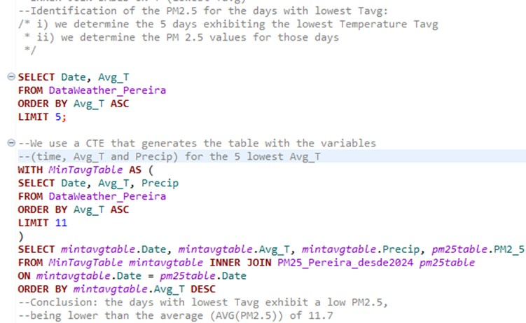
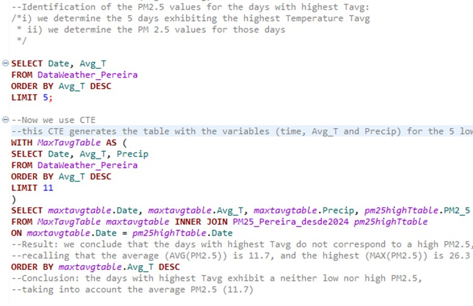
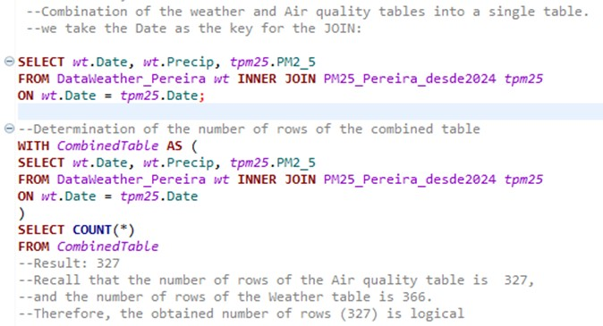
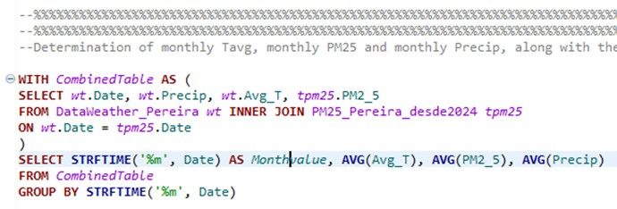
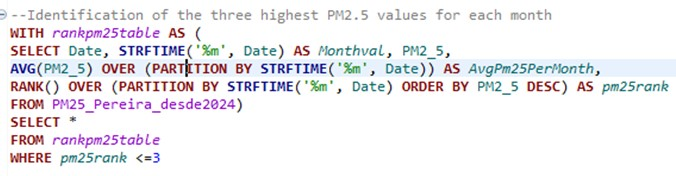
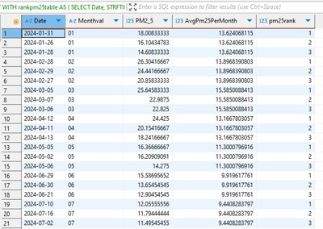

# SQL-Project-Air-quality-management-system
SQL Project: Air quality management system

## **Problem statement**
The city of Pereira, Colombia, has experienced a significant increase in the number of cars over the past few years, which has adversely affected air quality. This decline in air quality, in turn, impacts the health and quality of life of residents. To address this issue, data analytics (using for instance Power BI or Python) can help identify key factors, such as weather conditions, that influence air quality.  An important preliminary step is to manage the data by cleaning, querying, and organizing it via SQL, utilizing information collected from various websites.

## **Objective**
The objective is to conduct data wrangling and basic analysis of air quality and weather data for the city of Pereira, with the goal of facilitating future data analytics. This process includes data profiling, merging the weather and air quality tables, and examining the relationships between variables. The analysis will start with raw data and utilize SQL. 

## **Used tools/techniques**
Tools and techniques utilized:
- SQLite with DBeaver 25.0
- Aggregation Expressions
- Common Table Expressions (CTEs)
- Joins (Inner joins)
- Window functions

## **Methodology**
The daily weather data includes the date, daily minimum temperature, daily maximum temperature, daily average temperature, and daily precipitation, obtained from https://www.weatherandclimate.info/monitor/?id=80210&month=11&year=2024. The air quality data comprises the date and PM2.5 levels, collected from http://sisaire.ideam.gov.co/ideam-sisaire-web/consultas.xhtml. The downloaded CSV files were opened in MS Excel, where a new Date column was created. The updated Excel files were then saved as CSVs and uploaded into SQL's DBeaver. In DBeaver, there are two working tables: 1. A weather table with columns for Date, daily maximum temperature, daily minimum temperature, daily average temperature, and daily precipitation. 2. An air quality table with columns for Date and PM2.5 levels. Data management in SQL involves the following tasks:

-	Data Profiling, which includes aggregation and basic queries: 1. Identification of null values. 2. Calculation of average, minimum, and maximum values. 3. Count of the number of rows. 4. Detection of illogical (outlier) values. 
-	Combination of Weather and Air Quality Tables, utilizing INNER joins.
-	Basic analysis of the relationship between weather and air quality, which involves INNER joins, Common Table Expressions (CTEs) and window functions. This includes analyzing PM2.5 values in relation to temperature and precipitation levels. 

## **Overall conclusions and impact of the project**
-	The data profiling, data wrangling and basic analysis of relationship between variables facilitate a future data analysis that utilices for instance Python and Power BI. 
-	The data profiling conducted helped identify inconsistent values in the Tmin (daily mínimum temperature) column of the weather table.
-	The merging of weather and air quality tables combined with window functions, aggregations and common table expressions (CTEs) allowed the examination of the relationship between PM2.5, average temperature (Avg_T), and precipitation.
-	The analysis revealed a correlation between monthly PM2.5 levels and monthly air temperature (Avg_T). High PM2.5 levels are associated with high Avg_T values, whereas low PM2.5 levels correspond to low Avg_T values. In contrast, there is no evident relationship between PM2.5 levels and precipitation (Precip). 

## **Code based tasks and insights** 

There are two working tables: 
-	A weather table with columns for Date, daily maximum temperature, daily minimum temperature, daily average temperature (Avg_T), and daily precipitation (Precip). 
-	An air quality table with columns for Date and PM2.5 levels.

Data profiling for the air quality table:

<pre>

</pre>

Identification of the PM2.5 for the days with the lowest daily average temperature (Avg_T):  
  

> Insight: 
> The days with the lowest average temperatures exhibit PM2.5 values lower than the overall average of 11.7.  

<pre>

</pre>

Identification of PM2.5 levels on the days with the highest daily average temperatures (Avg_T):  

> Insight: 
> The days with the highest average temperature (Avg_T) show PM2.5 values that can be either lower or higher than the average of 11.7.  
     
<pre>

</pre>
    
Combining the weather and air quality tables into one unified table:

> Insight: 
> The combined table contains 327 rows, which is logical considering that the Air quality table has 327 rows and the Weather table has 366 rows.
  
<pre>

</pre>

Analysis of the relationship between monthly values of PM2.5, average temperature (Avg_T), and precipitation (Precip): 

> Insights: 
>- The highest monthly PM2.5 level (15.6) occurs in March, while the corresponding average temperature (Avg_T) is 23.7°C, the second highest value, and the monthly precipitation (Precip) measure of 2.28 is the second lowest.
>- The lowest monthly PM2.5 level (9.04) is recorded in November, with the average temperature (Avg_T) being 20.9°C, which is the lowest value. Additionally, the monthly precipitation (Precip) is 8.1, ranking as the fifth highest.
>- Monthly PM2.5 levels are related to Avg_T values: high PM2.5 levels correlate with high Avg_T values, while low PM2.5 levels correlate with low Avg_T values.
>- There is no evident correlation between the monthly values of PM2.5 and precipitation levels.  

<pre>

</pre>
Identify the three highest PM2.5 values for each month, as well as the monthly average PM2.5:

> Insights: 
>- The table above presents the three highest PM2.5 values for each month. It shows that the highest values occur in February and March, while lower values are observed in July and November.
>- The average monthly PM2.5 value is highest in March (15.6) and lowest in November (9.04).  

<pre>

</pre>
               
Identify the three highest PM2.5 values for each month, including their ranks and corresponding average values for temperature (Avg_T) and precipitation (Precip), as well as the monthly averages for PM2.5, Precip, and Avg_T:

> Insights: 
>- The three highest monthly PM2.5 values occur in February and March, while the corresponding average temperature (Avg_T) values are high, and the precipitation (Precip) values are low.
>- The highest monthly PM2.5 level of 15.6 occurs in March, which has a monthly average temperature of 23.6°C, the second highest value, and monthly precipitation of 2.28, the second lowest.
>- The lowest monthly PM2.5 level (9.04) occurs in November, which has the lowest average temperature (21°C) and the third highest precipitation (8.1). 
>- There is a relationship between the monthly values of PM2.5 and Avg_T: as Avg_T increases, PM2.5 also increases.  

