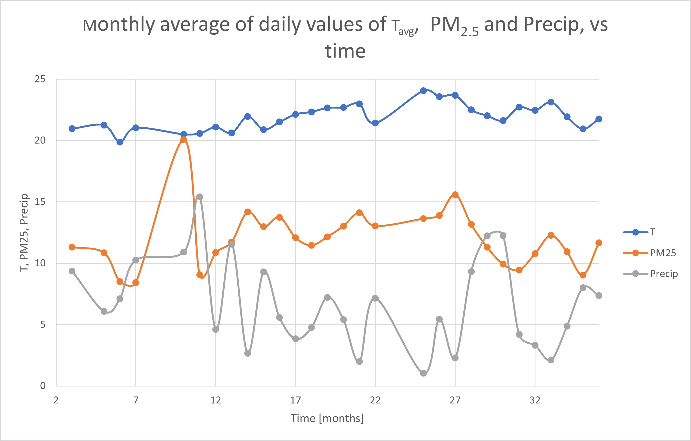

# SQL-Project-Air-quality-management-system
SQL Project: Air quality management system

## **Problem statement**
The city of Pereira, Colombia, has experienced a significant increase in the number of cars over the past few years, which has adversely affected air quality. This decline in air quality, in turn, impacts the health and quality of life of residents. To address this issue, data analytics (using for instance Power BI or Python) can help identify key factors, such as weather conditions, that influence air quality.  An important preliminary step is to manage the data by cleaning, querying, and organizing it via SQL, utilizing information collected from various websites.

## **Objective**
The objective is to conduct data wrangling and basic analysis of air quality and weather data for the city of Pereira, with the goal of facilitating future data analytics. This process includes data profiling, merging the weather and air quality tables, and examining the relationships between variables. The analysis will start with raw data and utilize SQL. 

## **Used tools/techniques**
Tools and techniques utilized:
- SQLite with DBeaver 25.0
- Aggregation Expressions
- Common Table Expressions (CTEs)
- Unions (UNION ALL)
- Joins (Inner joins)
- Window functions

## **Methodology**
The data correspond to Pereira (Colombia), period 2022 to 2024. The air quality measures correspond to Air Quality station Carder - Las Americas, Pereira, period 2022 to 2024. There are two datasets: the weather and the air quality datasets. 
- The daily weather data includes the date, daily minimum temperature, daily maximum temperature, daily average temperature, and daily precipitation, obtained from https://www.weatherandclimate.info/monitor/?id=80210&month=11&year=2024. 
- The air quality data comprises the date and PM2.5 levels, collected from http://sisaire.ideam.gov.co/ideam-sisaire-web/consultas.xhtml.

The downloaded CSV files were opened in MS Excel, where a new Date column was created. The updated Excel files were then saved as CSVs and uploaded into SQL's DBeaver. In DBeaver, there are two working tables:
- A weather table with columns for Date, daily maximum temperature, daily minimum temperature, daily average temperature, and daily precipitation.
- An air quality table with columns for Date and PM2.5 levels.

The data management in SQL involves the following tasks:
-	Data Profiling, which includes aggregation and basic queries: 1. Identification of null values. 2. Calculation of average, minimum, and maximum values. 3. Count of the number of rows. 4. Detection of illogical (outlier) values. 
-	Combination of Weather and Air Quality Tables, utilizing INNER joins.
-	Basic analysis of the relationship between weather and air quality, which involves INNER joins, Common Table Expressions (CTEs) and window functions. This includes analyzing PM2.5 values in relation to temperature and precipitation levels. 

## **Overall conclusions and impact of the project**
-	The data profiling, data wrangling and basic analysis of relationship between variables facilitate a future data analysis that utilices for instance Python and Power BI. 
-	The data profiling conducted helped identify inconsistent values in the Tmin (daily mínimum temperature) column of the weather table.
-	The merging of weather and air quality tables combined with window functions, aggregations and common table expressions (CTEs) allowed the examination of the relationship between PM2.5, average temperature (Avg_T), and precipitation.
-	The analysis revealed a correlation between monthly PM2.5 levels and monthly air temperature (Avg_T). High PM2.5 levels are associated with high Avg_T values, whereas low PM2.5 levels correspond to low Avg_T values. In contrast, there is no evident relationship between PM2.5 levels and precipitation (Precip). 

## **Recommendations**
* Protective measures for people must be taken on months with the highest air pollution, namely February and March. For instance, communication campaigns about health risks should be conducted during these months, especially for individuals with respiratory issues.
* Transportation measures should be taken on months with the highest air pollution. For instance, fostering the use of public transportation and low-carbon-emission transport, as well as imposing license plate restrictions.

## **Code based tasks and insights** 

There are two working tables: 
-	The weather table (DataWeather_PereiraFrom2022) with columns for Date, daily maximum temperature, daily minimum temperature, daily average temperature (Avg_T), and daily precipitation (Precip). 
-	The air quality table (PM25_PereiraFrom2022) with columns for Date and PM2.5 levels.

### ***Data profiling for Air quality (PM2.5)***:

</pre>
### ***Data profiling for the Weather table***:

</pre>

Remarks:
-	The result MIN(Min_T) = -8.5 is illogical.  From an indepth examination, I notice several illogical values in Min_T column, including 0.0. Then, I disregard Min_T column. 
-	The result MIN(Avg_T) = 0 is illogical. From an indepth examination of Avg_T column, I notice that Avg_T = 0 for Date 2022-07-26. Therefore, I delete the row involving  this value.

Elimination of row with Date 2022-07-26:

</pre>

### ***Determination of the monthly PM2.5 values, but segmented by years 2022, 2023, 2024***:

</pre>

</pre>

Excel figure:

</pre>

Remarks:
- The behavior of PM2.5 exhibits significant changes across years. As one example of this, the month exhibiting the highest average PM2.5 is different between the three years, and also the month exhibiting the lowest average PM2.5.  
-	In general, February exhibits a high PM2.5 for 2023 and 2024; whereas June exhibits a low PM2.5 for the three  years. 

### ***Determination of daily corresponding values of Tavg, Precip and PM2.5, along time***:

The Weather and Air quality tables are combined into a single table, using INNER JOIN, with the Date as the key for the JOIN. Basic combined table:

</pre>

</pre>

Also, I determine the number of rows:

</pre>

Result: 715. Recall that the number of rows of the Air quality table is  715, and the number of rows of the Weather table is 1095.  Therefore, the obtained number of rows (715) is logical.

Development of the combined table, but I also generate the time in days, that is, the Day series number, departing from 0, as it is necessary for the creation of figure of  AvgT, Precip, and PM2.5 along time:

</pre>

</pre>

Excel figure: 

</pre>

Remark: 
- From the above figures it follows that the time courses of daily averages of Tavg and PM2.5 do not showw a clear relationship between them.
- Therefore, it is necessary to examine the time courses of monthly averages.
  
### ***Determination of monthly corresponding values of Tavg, Precip and PM2.5, along time***:

</pre>

</pre>

Excel figure:

</pre>

</pre>

</pre>

Remark: there is a mild correlation between monthly PM2.5 levels and monthly air temperature (Avg_T): 
-	High PM2.5 levels are associated with high Avg_T values, whereas low PM2.5 levels correspond to low AvgT values. 
-	In contrast, there is no evident relationship between PM2.5 levels and precipitation (Precip).

</pre>

> Insights for 2024: 
>- The three highest monthly PM2.5 values occur in February and March, while the corresponding average temperature (Avg_T) values are high, and the precipitation (Precip) values are low.
>- The highest monthly PM2.5 level of 15.6 occurs in March, which has a monthly average temperature of 23.6°C, the second highest value, and monthly precipitation of 2.28, the second lowest.
>- The lowest monthly PM2.5 level (9.04) occurs in November, which has the lowest average temperature (21°C) and the third highest precipitation (8.1). 
>- There is a relationship between the monthly values of PM2.5 and Avg_T: as Avg_T increases, PM2.5 also increases.
 
</pre>

### ***Identification of the three highest PM2.5 values for each month, using Windows functions***:

</pre>

</pre>

Next, I Identify the three highest PM2.5 values for each month, but I also obtain the corresponding monthly averages AVG(T), AVG(Precip), and  AVG(PM2_5), for each Month:

</pre>

</pre>

Remark: there is a correlation between monthly PM2.5 levels and monthly air temperature (Avg_T): 
-	High PM2.5 levels are associated with high Avg_T values, whereas low PM2.5 levels correspond to low Avg_T values. 
-	In contrast, there is no evident relationship between PM2.5 levels and precipitation (Precip). 

